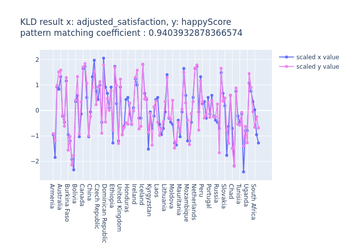
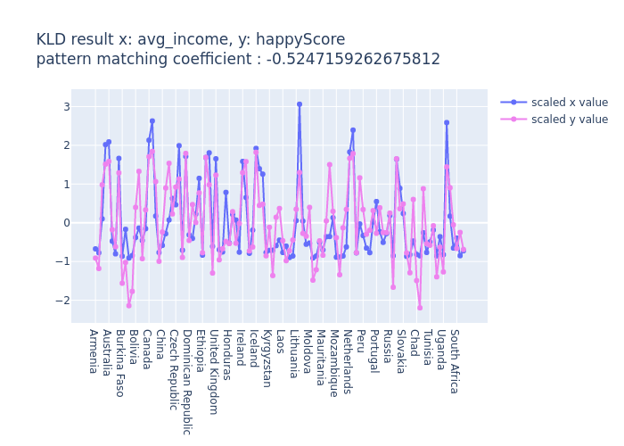
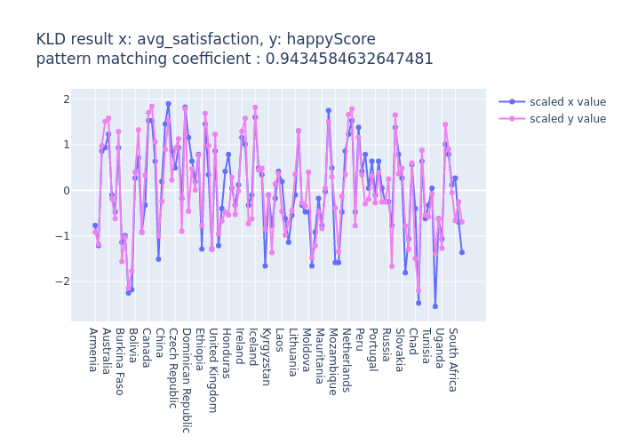
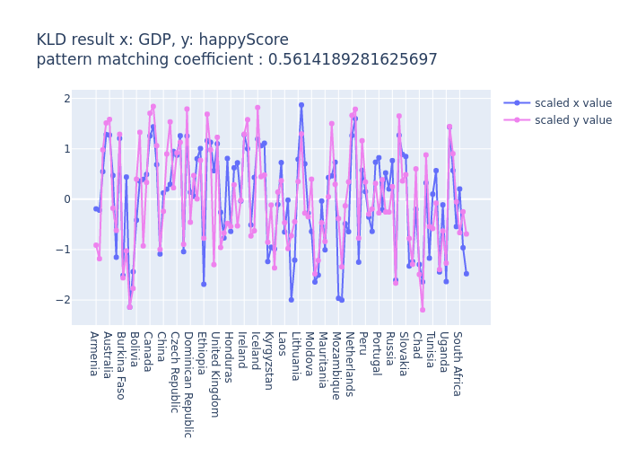
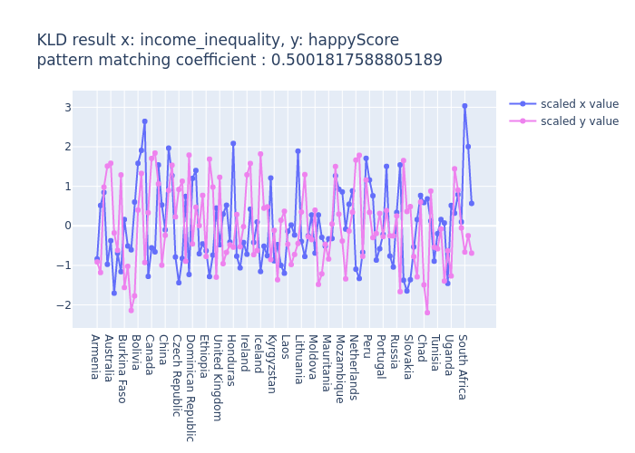
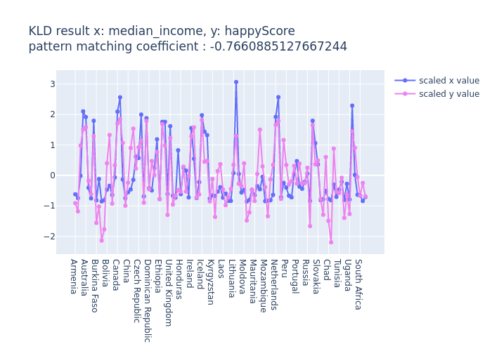
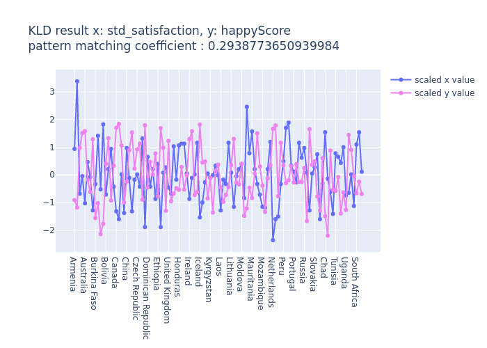

# KLD-correlation-analysis
Kullback Leibler Divergence

## Requeirements
numpy  
pandas  
scikit-learn  
plotly

## How to execution
$ python KL_divergence.py

## KLD result
  
  
  
  
  

  
